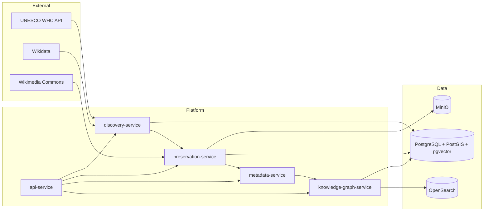

# WISE Implementation Overview

Maps the **architecture-v1.0** canonical documents to this repository's implementation structure for **Reference Capability 1** — one UNESCO World Heritage object end-to-end.

Canonical authority: `docs/architecture/canonical/`. This document is an implementation map, not a governance artifact.

---

## 1. Architecture alignment

### 1.1 Three planes

| Plane | Repository location | Reference |
|-------|---------------------|-----------|
| **Constitutional** | `docs/architecture/canonical/` | Open Grace governance documents |
| **Platform** | `services/`, `packages/` | 03-canonical-architecture §4 |
| **Experience** | `apps/demonstration-surface/` | 03 §5 (Founder Demonstration Surface only at this stage) |

### 1.2 Founder build order (ADR-003)

Reference Capability 1 implements Phases **1–7** for a single heritage object:

```
Discovery → Ingestion → Preservation → Knowledge Modeling → Knowledge Graph → Search (stub) → Quality
```

Public Experience (Phase 11) is **out of scope**. The `apps/demonstration-surface/` app is the Founder Demonstration Surface per `06-build-roadmap.md` §3.1.

### 1.3 Interface contracts (03 §7)

| Contract | Producer | Consumer | Package |
|----------|----------|----------|---------|
| Discovery Record (JSON-LD) | discovery-service | ingestion (preservation-service) | `wise-contracts` |
| Ingest Package (BagIt + PREMIS) | preservation-service | preservation store | `wise-contracts` |
| Preserved Object Descriptor (AIP) | preservation-service | metadata-service | `wise-contracts` |
| Entity Assertion (RDF) | metadata-service | knowledge-graph-service | `wise-contracts` |
| Quality Annotations | quality (metadata-service Phase 7) | knowledge-graph-service | `wise-contracts` |

---

## 2. Service map

| Service | Port | Phase | Agent spec | Responsibility |
|---------|------|-------|------------|----------------|
| `discovery-service` | 8001 | 1 | 09 | Source Registry, Discovery Records |
| `preservation-service` | 8003 | 2–3 | 11 | Ingestion, BagIt, ARK, MinIO, PREMIS |
| `metadata-service` | 8002 | 4, 7 | 10, 13 | Knowledge Modeling, Quality Review |
| `knowledge-graph-service` | 8004 | 5 | 12 | Entity graph, Wikidata/GeoNames links |
| `api-service` | 8000 | Gateway | — | REST gateway, Demonstration Surface API |



---

## 3. Data plane

### 3.1 PostgreSQL schemas

Initialized by `infrastructure/docker/postgres/init/01-extensions.sql`:

| Schema | Phase | Contents (Reference Capability 1) |
|--------|-------|-------------------------------------|
| `registry` | 1 | `sources` — Source Registry |
| `discovery` | 1 | `records` — Discovery Records |
| `ingestion` | 2 | `packages` — ingest workflow state |
| `preservation` | 3 | `objects`, `fixity_events`, `premis_events` |
| `modeling` | 4 | `entity_assertions` — pending approval |
| `graph` | 5 | `entities`, `relationships`, `external_links` |
| `quality` | 7 | `reviews`, `annotations` |

### 3.2 MinIO

- Bucket: `wise-preservation` (T0 Hot tier, Zone Alpha dev)
- BagIt ingest packages and preserved bitstreams
- ARK-mapped object keys: `ark:/99999/{identifier}/`

### 3.3 Reference object

Reference Capability 1 target: **Stonehenge** (UNESCO 373, Wikidata Q39671).

| Source | Registry role |
|--------|---------------|
| UNESCO World Heritage API | Primary heritage authority |
| Wikidata | Entity linking |
| Wikimedia Commons | Open-licensed surrogates |
| GeoNames | Place authority |

Reference extracts: `data/reference/`

---

## 4. Steward approval gates

All agent outputs require human approval before canonical writes (04-system-diagram §2.2):

```
Agent proposal → Steward review queue → Approved write → Canonical store
```

Workflow states are persisted in PostgreSQL with `status` columns: `proposed`, `approved`, `rejected`, `superseded`.

---

## 5. Evidence Output Profile (03 §6.6)

Assertion-making services attach to every output:

- `evidenceURIs[]`
- `confidence`
- `evidenceSummary`
- `method`
- `sourceRegistryRefs[]`
- `provenanceEventId`

Implemented in `packages/wise-contracts` during Reference Capability 1 business logic phase.

---

## 6. Standards (07-reference-standards)

| Standard | Application in RC1 |
|----------|-------------------|
| OAIS / PREMIS / BagIt | Ingest and preservation |
| ARK | Canonical object identifiers |
| CIDOC-CRM + Dublin Core + EDM | Heritage metadata |
| RightsStatements.org + CC | Rights on all public objects |
| GeoJSON / PostGIS | Site boundary geometry |
| Wikidata | External entity links |

---

## 7. Observability (scaffold)

OpenTelemetry, Prometheus, Grafana, and Loki are listed in the engineering stack but not deployed in this scaffold. Services emit structured logs via `structlog` in `wise-common`.

---

## 8. What this scaffold does not include

- Business logic and workflow implementations
- Database table migrations (placeholder in `infrastructure/migrations/`)
- Phase 11 Public Experience frontend
- Translation Fabric, Publishing, Observatories
- Production multi-zone deployment (05-physical-architecture)

---

## 9. Next implementation steps

1. Alembic migrations for `registry.sources` and downstream tables
2. UNESCO connector in `discovery-service`
3. BagIt ingest pipeline in `preservation-service`
4. CIDOC-CRM mapping in `metadata-service`
5. Graph entity placement in `knowledge-graph-service`
6. Demonstration Surface object page in `apps/demonstration-surface/`
7. Reference Capability 1 acceptance test suite in `tests/e2e/`

---

*Authority: [03-canonical-architecture.md](docs/architecture/canonical/03-canonical-architecture.md) · Build order: [06-build-roadmap.md](docs/architecture/canonical/06-build-roadmap.md)*
