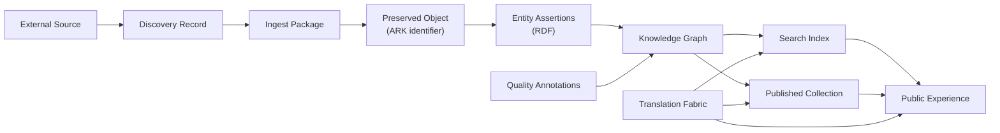
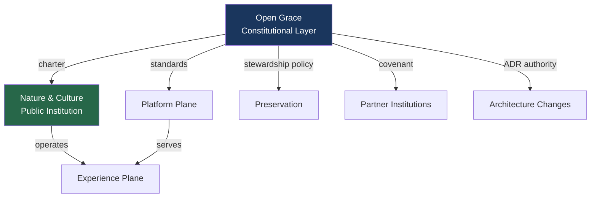
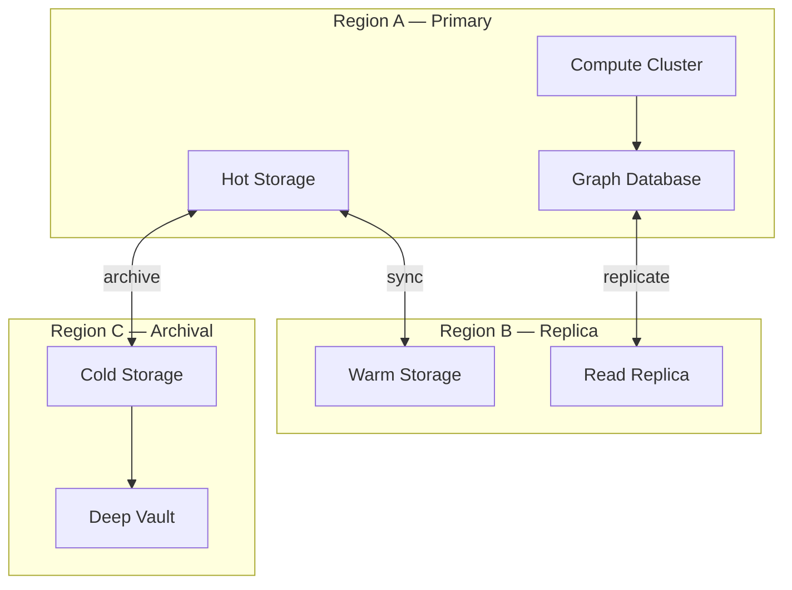

# Canonical System Diagram

| Field | Value |
|-------|-------|
| **Version** | 1.0 |
| **Status** | Canonical |
| **Authority** | Open Grace Architecture Office |
| **Date** | 2026-06-22 |

## Document Map

| Document | Purpose |
|----------|---------|
| [01-mission-and-constitutional-charter.md](01-mission-and-constitutional-charter.md) | Mission, charter, and constitutional relationship |
| [02-reference-models.md](02-reference-models.md) | Institutional reference models informing design |
| [03-canonical-architecture.md](03-canonical-architecture.md) | Canonical 100-year logical architecture |
| [04-system-diagram.md](04-system-diagram.md) | Canonical system diagram |
| [05-physical-architecture.md](05-physical-architecture.md) | Physical and geographic architecture |
| [06-build-roadmap.md](06-build-roadmap.md) | Implementation roadmap and founder build order |
| [07-reference-standards.md](07-reference-standards.md) | Standards, protocols, and interoperability |
| [08-decision-record.md](08-decision-record.md) | Architecture decision records |
| [09-source-discovery-agent.md](09-source-discovery-agent.md) | Source Discovery Agent specification |
| [10-metadata-agent.md](10-metadata-agent.md) | Metadata Agent specification |
| [11-preservation-agent.md](11-preservation-agent.md) | Preservation Agent specification |
| [12-knowledge-graph-agent.md](12-knowledge-graph-agent.md) | Knowledge Graph Agent specification |
| [13-quality-review-agent.md](13-quality-review-agent.md) | Quality Review Agent specification |
| [14-translation-agent.md](14-translation-agent.md) | Translation Agent specification |
| [15-publishing-agent.md](15-publishing-agent.md) | Publishing Agent specification |
| [16-education-agent.md](16-education-agent.md) | Education Agent specification |
| [17-biodiversity-observatory-agent.md](17-biodiversity-observatory-agent.md) | Biodiversity Observatory Agent specification |
| [18-climate-observatory-agent.md](18-climate-observatory-agent.md) | Climate Observatory Agent specification |
| [19-heritage-observatory-agent.md](19-heritage-observatory-agent.md) | Heritage Observatory Agent specification |
| [20-tourism-observatory-agent.md](20-tourism-observatory-agent.md) | Tourism Observatory Agent specification |
| [21-language-observatory-agent.md](21-language-observatory-agent.md) | Language Observatory Agent specification |
| [22-standards-agent.md](22-standards-agent.md) | Standards Agent specification |
| [23-benchmark-agent.md](23-benchmark-agent.md) | Benchmark Agent specification |

---

## 1. Purpose

This document provides the **canonical system diagram** for the Open Grace and Nature & Culture architecture. It is the visual authority for how components connect. Logical definitions are in [03-canonical-architecture.md](03-canonical-architecture.md); physical deployment is in [05-physical-architecture.md](05-physical-architecture.md).

This document presents two complementary views:

| View | Section | Use |
|------|---------|-----|
| **Operational stack** | §2 | Mission-to-outcomes stack, source ecosystem, platform, AI, factories, commerce, engineering, SRE, and preservation network |
| **Logical planes** | §3 | Constitutional, platform, and experience planes per [03-canonical-architecture.md](03-canonical-architecture.md) |

---

## 2. Operational Canonical Diagram

The authoritative end-to-end stack from mission through outcomes. Engineering, AI, commerce, factory, and SRE layers are operational capabilities that support the technology-agnostic logical architecture in [03-canonical-architecture.md](03-canonical-architecture.md).

```
╔══════════════════════════════════════════════════════════════════════╗
║                               MISSION                              ║
╠══════════════════════════════════════════════════════════════════════╣
║ Permanent Digital Memory of Humanity                               ║
║ Heritage • Nature • Culture • Knowledge                            ║
╚══════════════════════════════════════════════════════════════════════╝
                                   │
                                   ▼

╔══════════════════════════════════════════════════════════════════════╗
║                            OPEN GRACE                              ║
║               Governance + Standards + Authority                   ║
╚══════════════════════════════════════════════════════════════════════╝

 Constitution
 Governance
 Standards
 Systems Engineering
 Security
 Audit
 Risk
 AI Governance
 Strategy
 Performance

                                   │
                                   ▼

╔══════════════════════════════════════════════════════════════════════╗
║                        NATURE & CULTURE                            ║
║                    Public Institution Layer                        ║
╚══════════════════════════════════════════════════════════════════════╝

 Heritage
 Nature
 Culture
 Knowledge

                                   │
                                   ▼

╔══════════════════════════════════════════════════════════════════════╗
║                        KNOWLEDGE PIPELINE                          ║
╚══════════════════════════════════════════════════════════════════════╝

 Discovery
     ↓
 Acquisition
     ↓
 Ingestion
     ↓
 Validation
     ↓
 Preservation
     ↓
 Knowledge Modeling
     ↓
 Knowledge Graph
     ↓
 Translation
     ↓
 Publishing
     ↓
 Education
     ↓
 Commerce

                                   │
                                   ▼

╔══════════════════════════════════════════════════════════════════════╗
║                        SOURCE ECOSYSTEM                            ║
╚══════════════════════════════════════════════════════════════════════╝

 UNESCO
 GBIF
 Wikidata
 Wikimedia Commons
 OpenStreetMap
 Europeana
 Internet Archive
 Museums
 Libraries
 Archives

                                   │
                                   ▼

╔══════════════════════════════════════════════════════════════════════╗
║                          DATA PLATFORM                             ║
╚══════════════════════════════════════════════════════════════════════╝

 PostgreSQL
 PostGIS
 pgvector
 MinIO

                                   │
                                   ▼

╔══════════════════════════════════════════════════════════════════════╗
║                      KNOWLEDGE GRAPH CORE                          ║
╚══════════════════════════════════════════════════════════════════════╝

 CIDOC CRM
 Darwin Core
 Dublin Core
 RDF
 OWL
 SKOS
 PROV
 IIIF

                                   │
                                   ▼

╔══════════════════════════════════════════════════════════════════════╗
║                     APPLICATION PLATFORM                           ║
╚══════════════════════════════════════════════════════════════════════╝

 Objects Service
 Collections Service
 Search Service
 Media Service
 Translation Service
 Publishing Service
 Education Service
 Commerce Service
 Analytics Service

                                   │
                                   ▼

╔══════════════════════════════════════════════════════════════════════╗
║                           AI PLATFORM                              ║
╚══════════════════════════════════════════════════════════════════════╝

 Qwen        → Research
 Claude      → Architecture
 DeepSeek    → Engineering
 Gemini      → Independent Audit
 Codex       → Implementation

 Agent Registry
 Benchmark Registry
 Evaluation Framework
 LangGraph Runtime

                                   │
                                   ▼

╔══════════════════════════════════════════════════════════════════════╗
║                        PUBLIC EXPERIENCE                           ║
╚══════════════════════════════════════════════════════════════════════╝

 Website
 Search
 Collections
 Maps
 Timelines
 Heritage Pages
 Species Pages
 Learning Resources
 Digital Exhibitions

                                   │
                 ┌─────────────────┼─────────────────┐
                 ▼                 ▼                 ▼

            Publishing       Education        Community

                                   │
                                   ▼

╔══════════════════════════════════════════════════════════════════════╗
║                         CONTENT FACTORY                            ║
╚══════════════════════════════════════════════════════════════════════╝

 Articles
 Collections
 Encyclopedias
 Handbooks
 Field Guides
 Books
 Ebooks
 Audiobooks
 Videos
 Podcasts
 Courses

                                   │
                                   ▼

╔══════════════════════════════════════════════════════════════════════╗
║                         PRODUCT FACTORY                            ║
╚══════════════════════════════════════════════════════════════════════╝

 Wall Art Factory
 Calendar Factory
 Puzzle Factory
 Paint-by-Numbers Factory
 Map Factory
 Book Factory
 Drinkware Factory
 Apparel Factory
 Educational Kit Factory

                                   │
        ┌────────────┬─────────────┬─────────────┬─────────────┐
        ▼            ▼             ▼             ▼

   Wall Art     Calendars      Puzzles     Paint-by-Numbers

        ▼            ▼             ▼             ▼

 Heritage      Heritage       Heritage      Heritage
 Wildlife      Wildlife       Wildlife      Wildlife
 Maps          Maps           Maps          Maps
 Nature        Nature         Nature        Nature

                                   │
                                   ▼

╔══════════════════════════════════════════════════════════════════════╗
║                        DRINKWARE FACTORY                           ║
╚══════════════════════════════════════════════════════════════════════╝

 Heritage Mugs
 Wildlife Mugs
 Historical Map Mugs
 National Park Mugs
 Educational Mugs

 Ceramic Mugs
 Travel Mugs
 Enamel Mugs
 Tumblers
 Water Bottles

                                   │
                                   ▼

╔══════════════════════════════════════════════════════════════════════╗
║                       COMMERCIAL OPERATIONS                        ║
╚══════════════════════════════════════════════════════════════════════╝

 Wall Art
 Calendars
 Jigsaw Puzzles
 Paint-by-Numbers
 Maps
 Books
 Mugs
 Water Bottles
 Apparel
 Educational Kits

 Memberships
 Sponsorships
 Donations
 Licensing
 Endowment

                                   │
                                   ▼

╔══════════════════════════════════════════════════════════════════════╗
║                     PLATFORM ENGINEERING                           ║
╚══════════════════════════════════════════════════════════════════════╝

 Cursor
 Git
 Claude Code
 Codex CLI
 Ollama
 Docker
 CI/CD

                                   │
                                   ▼

╔══════════════════════════════════════════════════════════════════════╗
║                         SRE & OPERATIONS                           ║
╚══════════════════════════════════════════════════════════════════════╝

 Monitoring
 Logging
 Alerting
 Incident Response
 Reliability Reviews
 Disaster Recovery

 Prometheus
 Grafana

                                   │
                                   ▼

╔══════════════════════════════════════════════════════════════════════╗
║                   GLOBAL PRESERVATION NETWORK                      ║
╚══════════════════════════════════════════════════════════════════════╝

 Primary Archive
 Regional Mirrors
 Archive Nodes
 Search Nodes
 Knowledge Nodes
 AI Nodes

 Replication
 Integrity Verification
 Format Migration

                                   │
                                   ▼

╔══════════════════════════════════════════════════════════════════════╗
║                              OUTCOMES                              ║
╚══════════════════════════════════════════════════════════════════════╝

 Global Knowledge Commons
 Heritage Preservation
 Biodiversity Preservation
 Cultural Preservation

 Publishing Infrastructure
 Education Infrastructure
 Commerce Infrastructure

 Civilizational Memory
 For Future Generations
```

### 2.1 Operational Layer Definitions

| Operational Layer | Role | Logical Mapping |
|-------------------|------|-----------------|
| Mission | Constitutional north star for permanent digital memory | [01-mission-and-constitutional-charter.md](01-mission-and-constitutional-charter.md) |
| Open Grace | Governance, standards, authority, risk, audit, and AI governance | Constitutional Plane (§3) |
| Nature & Culture | Public institution for heritage, nature, culture, and knowledge | Experience Plane (§5) |
| Knowledge Pipeline | Sequential value chain from discovery through commerce | Platform Plane (§4) + Experience Plane (§5) |
| Source Ecosystem | Partner and public source authorities | Discovery inputs (§4.1) |
| Data Platform | Relational, geospatial, vector, and object storage substrate | Physical Plane and data platform (§7) |
| Knowledge Graph Core | Ontologies, graph standards, provenance, and presentation standards | Knowledge Modeling (§4.4) + Knowledge Graph (§4.5) |
| Application Platform | Service layer serving platform and experience capabilities | Interface contracts (§7) |
| AI Platform | Model councils, agent registry, benchmarks, evaluations, and LangGraph runtime | AI Fabric governance (§2.3) |
| Public Experience | Website, search, maps, entity pages, learning, and exhibitions | Experience Plane (§5.1) |
| Content Factory | Editorial production from canonical memory | Publishing (§4.10) + Education (§5.3) |
| Product Factory | Mission-aligned product generation from canonical assets | Products (§5.2) |
| Commercial Operations | Revenue operations that fund mission without gating public memory | Products (§5.2) under ADR-010 |
| Platform Engineering | Engineering tools, source control, containers, and delivery pipelines | Founder implementation stack (§2.2) |
| SRE & Operations | Reliability, monitoring, incident response, and disaster recovery | Events and observability (§6.5) + Physical Architecture |
| Global Preservation Network | Archives, mirrors, nodes, replication, fixity, and migration | Physical Architecture + Preservation (§4.3) |
| Outcomes | Public, preservation, education, commerce, and civilizational-memory outcomes | Mission fulfillment |

### 2.2 Engineering and SRE Stack

Founder-phase implementation stack. Physical deployment detail is in [05-physical-architecture.md](05-physical-architecture.md).

```
Cursor
   │
Git
   │
GitHub / CI-CD
   │
Docker
   │
FastAPI
   │
PostgreSQL + PostGIS + pgvector
   │
Redis + OpenSearch
   │
MinIO
   │
OpenTelemetry
   │
Prometheus
   │
Grafana
   │
Loki
```

SRE capabilities include monitoring, logging, alerting, incident response, reliability reviews, disaster recovery, replication verification, fixity verification, and format-migration readiness.

### 2.3 AI Platform

Agent councils support architecture, implementation, research, engineering, and independent audit. All agent outputs pass through registry, benchmarks, evaluations, safety reviews, and human approval before affecting canonical systems.

Platform agents automate discovery, preservation, knowledge modeling, and knowledge-graph operations under AI Platform governance:

- **Publishing Agent** ([15-publishing-agent.md](15-publishing-agent.md)) — assembles encyclopedias, field guides, books, and reports; generates IIIF manifests; enforces editorial gates before publication release.
- **Source Discovery Agent** ([09-source-discovery-agent.md](09-source-discovery-agent.md)) — discovers UNESCO sites, GBIF datasets, public-domain collections, and metadata sources (OAI-PMH, APIs), emitting candidate Discovery Records for steward approval before ingestion.
- **Preservation Agent** ([11-preservation-agent.md](11-preservation-agent.md)) — verifies file integrity, generates checksums, tracks provenance via PREMIS events, and monitors preservation risk, emitting fixity records and AIP descriptors while requiring steward approval for migrations and restores.
- **Metadata Agent** ([10-metadata-agent.md](10-metadata-agent.md)) — normalizes metadata, maps fields to CIDOC-CRM, Dublin Core, and Darwin Core, validates schemas, and proposes authority records, emitting candidate Entity Assertions for steward approval before knowledge-graph placement.
- **Knowledge Graph Agent** ([12-knowledge-graph-agent.md](12-knowledge-graph-agent.md)) — links entities, builds cross-domain relationships, detects duplicates, and maintains graph integrity, emitting link proposals and reconciliation candidates for curator approval before canonical graph writes.
- **Quality Review Agent** ([13-quality-review-agent.md](13-quality-review-agent.md)) — evaluates metadata quality, rights clearance, accessibility compliance, and content completeness, emitting quality scores and curation queue entries for steward approval before publication or research-channel release.
- **Translation Agent** ([14-translation-agent.md](14-translation-agent.md)) — translates entity labels, narratives, and UI strings; manages terminology and translation memory; routes indigenous-language content through community-governed review, emitting Translation Proposals for steward approval before localized graph writes.
- **Biodiversity Observatory Agent** ([17-biodiversity-observatory-agent.md](17-biodiversity-observatory-agent.md)) — tracks **species**, **occurrences**, and **threatened taxa**; emits trend signals and conservation alerts as Observatory Observation Records for steward approval before observatory feeds enter dashboards and Research Fabric exports.
- **Heritage Observatory Agent** ([19-heritage-observatory-agent.md](19-heritage-observatory-agent.md)) — tracks World Heritage site condition, threats, and conservation status; emits Observatory Observation Records for steward review before canonical observatory writes.
- **Language Observatory Agent** ([21-language-observatory-agent.md](21-language-observatory-agent.md)) — tracks endangered languages and revitalization programs over time; ingests vitality signals from partner feeds; emits Vitality Observations and Revitalization Program Records for language-steward approval before observatory time series enter the Knowledge Graph and public dashboards.
- **Education Agent** ([16-education-agent.md](16-education-agent.md)) — generates curriculum-aligned learning resources, curriculum mappings, and teacher guides, emitting Learning Resource Proposals for educator approval before Education catalog writes.
- **Climate Observatory Agent** ([18-climate-observatory-agent.md](18-climate-observatory-agent.md)) — ingests climate and conservation feeds across **climate impacts**, **protected areas**, and **heritage risk** tracks; correlates indicators with graph-linked sites and protected estates; emits Observatory Observation Proposals for steward and curator approval before observatory writes.
- **Tourism Observatory Agent** ([20-tourism-observatory-agent.md](20-tourism-observatory-agent.md)) — tracks **visitor patterns** and **sustainability indicators** at heritage and natural sites; detects trend anomalies; emits Observatory Observation Proposals for steward approval before observatory catalog and dashboard publication.
- **Standards Agent** ([22-standards-agent.md](22-standards-agent.md)) — verifies conformance against the Standards Registry for **CIDOC-CRM**, **Darwin Core**, and **schema.org**; aggregates automated compliance evidence; emits Standards Compliance Reports for Architecture Office review before milestone gates advance.
- **Benchmark Agent** ([23-benchmark-agent.md](23-benchmark-agent.md)) — evaluates registered agents for **agent performance**, **quality metrics**, and **architecture compliance**; emits Benchmark Reports for Architecture Office and council review before Evaluations and production clearance.

```
Qwen        → Research Council
Claude      → Architecture Council
DeepSeek    → Engineering Council
Gemini      → Independent Audit Council
Codex       → Implementation Council
                ↓
Agent Registry
Benchmark Registry
Evaluation Framework
Safety Reviews
Human Approval
LangGraph Runtime
```

### 2.4 Core Principle

The non-negotiable value chain from source to future generations:

```
Sources
  ↓
Evidence
  ↓
Preservation
  ↓
Knowledge
  ↓
Quality
  ↓
Research
  ↓
Education
  ↓
Public Access
  ↓
Sustainable Mission Support
  ↓
Future Generations
```

### 2.5 Operational-to-Logical Mapping

| Operational Layer (§2) | Logical Plane ([03-canonical-architecture.md](03-canonical-architecture.md)) |
|------------------------|-------------------------------------------------------------------------------|
| Mission | [01-mission-and-constitutional-charter.md](01-mission-and-constitutional-charter.md) — Nature & Culture public mandate |
| Open Grace | §3 Constitutional Plane |
| Nature & Culture | §5 Experience Plane |
| Knowledge Pipeline | §4 Platform Plane + §5 Experience Plane |
| Source Ecosystem | §4.1 Discovery inputs + [02-reference-models.md](02-reference-models.md) |
| Data Platform | §4.3 Preservation + [05-physical-architecture.md](05-physical-architecture.md) |
| Knowledge Graph Core | §4.4 Knowledge Modeling + §4.5 Knowledge Graph |
| Application Platform | §7 Interface Contracts |
| AI Platform | §2.3 AI Platform + agent specifications 09–23 |
| Public Experience | §5.1 Public Experience |
| Content Factory | §4.10 Publishing + §5.3 Education |
| Product Factory | §5.2 Products |
| Drinkware Factory | §5.2 Products |
| Commercial Operations | §5.2 Products, constrained by [ADR-010](08-decision-record.md#adr-010-free-access-constitutional-commitment) |
| Platform Engineering | Founder-phase implementation stack (§2.2) |
| SRE & Operations | §6.5 Events and Observability + [05-physical-architecture.md](05-physical-architecture.md) |
| Global Preservation Network | §4.3 Preservation + [05-physical-architecture.md](05-physical-architecture.md) |
| Outcomes | Mission fulfillment under [01-mission-and-constitutional-charter.md](01-mission-and-constitutional-charter.md) |

---

## 3. Logical Plane Diagram

```mermaid
flowchart TB
    subgraph CONSTITUTIONAL["CONSTITUTIONAL PLANE — Open Grace"]
        CHARTER["Constitutional Charter"]
        ARCH_OFFICE["Architecture Office"]
        STANDARDS["Standards Registry"]
        ADR["Decision Records"]
        COVENANT["Covenant Framework"]
        STEWARDSHIP["Stewardship Policy"]
    end

    subgraph EXTERNAL["External Sources & Partners"]
        MUSEUMS["Museums & Archives"]
        GBIF_NODES["GBIF Nodes"]
        UNESCO_WH["UNESCO / World Heritage"]
        WIKIDATA["Wikidata / Wikimedia"]
        PARTNERS["Partner Institutions"]
        CONTRIBUTORS["Community Contributors"]
        OBSERVATORY_FEEDS["Observatory Feeds"]
    end

    subgraph PLATFORM["PLATFORM PLANE — Core Capabilities"]
        direction TB

        subgraph ACQUIRE["Acquire"]
            DISCOVERY["Discovery"]
            INGESTION["Ingestion"]
        end

        subgraph STEWARD["Steward"]
            PRESERVATION["Preservation"]
            QUALITY["Quality Platform"]
        end

        subgraph KNOW["Know"]
            MODELING["Knowledge Modeling"]
            GRAPH["Knowledge Graph"]
        end

        subgraph ACCESS["Access"]
            SEARCH["Search"]
            RESEARCH["Research Fabric"]
            TRANSLATION["Translation Fabric"]
            PUBLISHING["Publishing"]
        end
    end

    subgraph EXPERIENCE["EXPERIENCE PLANE — Nature & Culture"]
        PUBLIC["Public Experience"]
        PRODUCTS["Products"]
        EDUCATION["Education"]
        COMMUNITY["Community"]
        OBSERVATORIES["Observatories"]
    end

    subgraph PHYSICAL["PHYSICAL PLANE"]
        HOT["Hot Tier"]
        WARM["Warm Tier"]
        COLD["Cold Tier"]
        DEEP["Deep Archive Vault"]
        REGIONS["Multi-Region Replicas"]
    end

  %% Constitutional governance
    CHARTER --> ARCH_OFFICE
    ARCH_OFFICE --> STANDARDS
    ARCH_OFFICE --> ADR
    CHARTER --> STEWARDSHIP
    CHARTER --> COVENANT

  %% External to Discovery
    MUSEUMS --> DISCOVERY
    GBIF_NODES --> DISCOVERY
    UNESCO_WH --> DISCOVERY
    WIKIDATA --> DISCOVERY
    PARTNERS --> DISCOVERY
    CONTRIBUTORS --> DISCOVERY
    OBSERVATORY_FEEDS --> DISCOVERY

  %% Acquire flow
    DISCOVERY --> INGESTION
    INGESTION --> PRESERVATION

  %% Steward flow
    PRESERVATION --> MODELING
    PRESERVATION --> QUALITY
    QUALITY --> GRAPH

  %% Know flow
    MODELING --> GRAPH
    GRAPH --> SEARCH
    GRAPH --> RESEARCH
    GRAPH --> PUBLISHING
    TRANSLATION --> SEARCH
    TRANSLATION --> PUBLISHING

  %% Access to Experience
    SEARCH --> PUBLIC
    PUBLISHING --> PUBLIC
    PUBLISHING --> EDUCATION
    RESEARCH --> PRODUCTS
    GRAPH --> PUBLIC
    TRANSLATION --> PUBLIC
    TRANSLATION --> EDUCATION

    PUBLIC --> PRODUCTS
    COMMUNITY --> DISCOVERY
    COMMUNITY --> INGESTION
    COMMUNITY --> TRANSLATION
    OBSERVATORIES --> INGESTION
    OBSERVATORIES --> GRAPH
    OBSERVATORIES --> PUBLIC

  %% Physical backing
    PRESERVATION --> HOT
    PRESERVATION --> WARM
    PRESERVATION --> COLD
    PRESERVATION --> DEEP
    HOT --> REGIONS
    WARM --> REGIONS
    COLD --> REGIONS
    DEEP --> REGIONS

  %% Governance overlay
    STEWARDSHIP -.-> PRESERVATION
    STEWARDSHIP -.-> QUALITY
    STANDARDS -.-> INGESTION
    STANDARDS -.-> MODELING
    COVENANT -.-> PARTNERS
    COVENANT -.-> DISCOVERY

  %% Styling
    classDef constitutional fill:#1a365d,color:#fff,stroke:#2c5282
    classDef platform fill:#2d3748,color:#fff,stroke:#4a5568
    classDef experience fill:#276749,color:#fff,stroke:#38a169
    classDef external fill:#744210,color:#fff,stroke:#d69e2e
    classDef physical fill:#553c9a,color:#fff,stroke:#805ad5

    class CHARTER,ARCH_OFFICE,STANDARDS,ADR,COVENANT,STEWARDSHIP constitutional
    class DISCOVERY,INGESTION,PRESERVATION,QUALITY,MODELING,GRAPH,SEARCH,RESEARCH,TRANSLATION,PUBLISHING platform
    class PUBLIC,PRODUCTS,EDUCATION,COMMUNITY,OBSERVATORIES experience
    class MUSEUMS,GBIF_NODES,UNESCO_WH,WIKIDATA,PARTNERS,CONTRIBUTORS,OBSERVATORY_FEEDS external
    class HOT,WARM,COLD,DEEP,REGIONS physical
```



---

## 4. Data Flow Diagram

Primary data flow from external source to public experience:



---

## 5. Founder Build Order Diagram

Sequential build phases as defined in [06-build-roadmap.md](06-build-roadmap.md):


**Color key:** Blue = Acquire · Purple = Know · Gold = Access · Green = Experience

---

## 6. Governance Overlay Diagram

How Open Grace governs without operating public systems:



---

## 7. Physical Deployment Diagram

Logical-to-physical mapping (detail in [05-physical-architecture.md](05-physical-architecture.md)):



---

## 8. Layer Dependency Matrix

| Layer | Depends On | Consumed By |
|-------|-----------|-------------|
| Discovery | External sources, Covenant | Ingestion, Community |
| Ingestion | Discovery | Preservation |
| Preservation | Ingestion | Knowledge Modeling, Quality |
| Knowledge Modeling | Preservation | Knowledge Graph |
| Knowledge Graph | Knowledge Modeling, Quality | Search, Research, Publishing, Experience |
| Search | Knowledge Graph, Translation | Public Experience |
| Quality Platform | Preservation, Knowledge Graph | Knowledge Graph |
| Research Fabric | Knowledge Graph, Preservation | Products, Observatories |
| Translation Fabric | Knowledge Graph | Search, Publishing, all Experience |
| Publishing | Knowledge Graph, Translation | Public Experience, Education |
| Public Experience | Search, Publishing, Graph, Translation | Products |
| Products | Public Experience, Research | External consumers |
| Education | Publishing, Graph, Translation | Public |
| Community | Discovery, Ingestion, Translation | Discovery, Ingestion |
| Observatories | Ingestion, Graph, Research | Public Experience |

---

## 9. Compact Logical Diagram

For environments where Mermaid is unavailable, a compact three-plane view:

```
╔═══════════════════════════════════════════════════════════════════════════╗
║                    OPEN GRACE — CONSTITUTIONAL PLANE                      ║
║  Charter │ Architecture Office │ Standards │ ADRs │ Covenants │ Policy   ║
╚═══════════════════════════════════╤═══════════════════════════════════════╝
                                    │ governs
        ┌───────────────────────────┼───────────────────────────┐
        │                           │                           │
        ▼                           ▼                           ▼
┌───────────────┐         ┌─────────────────┐         ┌───────────────────┐
│   External    │         │  PLATFORM PLANE │         │  NATURE & CULTURE │
│   Sources     │────────▶│                 │────────▶│  EXPERIENCE PLANE │
│               │         │  Discovery      │         │                   │
│  Museums      │         │  Ingestion      │         │  Public Experience│
│  GBIF         │         │  Preservation ──┼──▶ Physical Tiers          │
│  UNESCO       │         │  Know. Modeling │         │  Products         │
│  Wikidata     │         │  Knowledge Graph│         │  Education        │
│  Partners     │         │  Search         │         │  Community        │
│  Contributors │         │  Quality Plat.  │         │  Observatories    │
│  Observatories│         │  Research Fab.  │         │                   │
└───────────────┘         │  Translation    │         └───────────────────┘
                          │  Publishing     │
                          └─────────────────┘
```

---

## 10. Diagram Authority

This diagram is canonical. Updates require an ADR in [08-decision-record.md](08-decision-record.md) when component relationships change. Cosmetic rendering changes do not require an ADR.

---

*Previous: [03-canonical-architecture.md](03-canonical-architecture.md) · Next: [05-physical-architecture.md](05-physical-architecture.md)*
