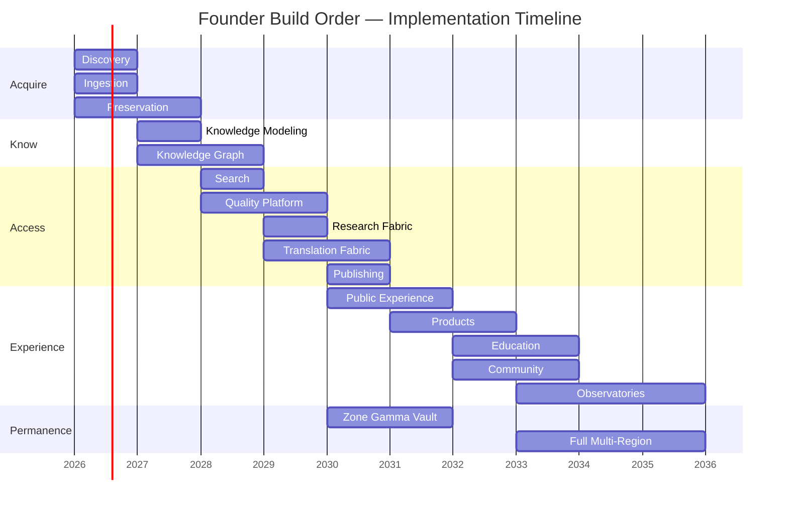

# Build Roadmap

| Field | Value |
|-------|-------|
| **Version** | 1.0 |
| **Status** | Canonical |
| **Authority** | Open Grace Architecture Office |
| **Date** | 2026-06-22 |

## Document Map

| Document | Purpose |
|----------|---------|
| [01-mission-and-constitutional-charter.md](01-mission-and-constitutional-charter.md) | Mission, charter, and constitutional relationship |
| [02-reference-models.md](02-reference-models.md) | Institutional reference models informing design |
| [03-canonical-architecture.md](03-canonical-architecture.md) | Canonical 100-year logical architecture |
| [04-system-diagram.md](04-system-diagram.md) | Canonical system diagram |
| [05-physical-architecture.md](05-physical-architecture.md) | Physical and geographic architecture |
| [06-build-roadmap.md](06-build-roadmap.md) | Implementation roadmap and founder build order |
| [07-reference-standards.md](07-reference-standards.md) | Standards, protocols, and interoperability |
| [08-decision-record.md](08-decision-record.md) | Architecture decision records |
| [09-source-discovery-agent.md](09-source-discovery-agent.md) | Source Discovery Agent specification |
| [10-metadata-agent.md](10-metadata-agent.md) | Metadata Agent specification |
| [11-preservation-agent.md](11-preservation-agent.md) | Preservation Agent specification |
| [12-knowledge-graph-agent.md](12-knowledge-graph-agent.md) | Knowledge Graph Agent specification |
| [13-quality-review-agent.md](13-quality-review-agent.md) | Quality Review Agent specification |
| [14-translation-agent.md](14-translation-agent.md) | Translation Agent specification |
| [15-publishing-agent.md](15-publishing-agent.md) | Publishing Agent specification |
| [16-education-agent.md](16-education-agent.md) | Education Agent specification |
| [17-biodiversity-observatory-agent.md](17-biodiversity-observatory-agent.md) | Biodiversity Observatory Agent specification |
| [18-climate-observatory-agent.md](18-climate-observatory-agent.md) | Climate Observatory Agent specification |
| [19-heritage-observatory-agent.md](19-heritage-observatory-agent.md) | Heritage Observatory Agent specification |
| [20-tourism-observatory-agent.md](20-tourism-observatory-agent.md) | Tourism Observatory Agent specification |
| [21-language-observatory-agent.md](21-language-observatory-agent.md) | Language Observatory Agent specification |
| [22-standards-agent.md](22-standards-agent.md) | Standards Agent specification |
| [23-benchmark-agent.md](23-benchmark-agent.md) | Benchmark Agent specification |

---

## 1. Purpose

This document defines the **implementation roadmap** for Open Grace and Nature & Culture, including the **founder build order** — the canonical sequence in which capabilities must be built. The build order reflects the principle that preservation and knowledge come before public experience.

Architecture definitions: [03-canonical-architecture.md](03-canonical-architecture.md). Physical milestones: [05-physical-architecture.md](05-physical-architecture.md). Decision rationale: [08-decision-record.md](08-decision-record.md), ADR-003. Founder execution companion (engineering substrate, gates, demonstration surface): [founder-execution-roadmap.md](../../constitution/founder-execution-roadmap.md).

---

## 2. Roadmap Horizons

| Horizon | Years | Focus |
|---------|-------|-------|
| **Foundation** | 1–3 | Acquire and steward: Discovery through Knowledge Graph |
| **Access** | 3–5 | Make knowledge findable: Search through Publishing |
| **Experience** | 5–8 | Serve the public: Public Experience through Community |
| **Scale** | 8–15 | Global reach: Observatories, sovereignty zones, full Translation |
| **Permanence** | 15–100 | Institutional continuity: migration, succession, covenant expansion |

---

## 3. Founder Build Order

The founder build order is **canonical and sequential**. Each phase depends on the outputs of prior phases. Phases may not be skipped.

```
 1. Discovery
 2. Ingestion
 3. Preservation
 4. Knowledge Modeling
 5. Knowledge Graph
 6. Search
 7. Quality Platform
 8. Research Fabric
 9. Translation Fabric
10. Publishing
11. Public Experience
12. Products
13. Education
14. Community
15. Observatories
```

Build order diagram: [04-system-diagram.md](04-system-diagram.md), Section 4.

### 3.1 Founder Demonstration Surface (Phases 1–3)

During Discovery, Ingestion, and Preservation, the institution MAY operate a **Founder Demonstration Surface** — a steward-gated, read-only preview demonstrating the provenance chain to funders and partners. This is **not** Public Experience (Phase 11) and does not satisfy public launch criteria.

| Attribute | Specification |
|-----------|--------------|
| **Permitted phases** | 1 (Discovery), 2 (Ingestion), 3 (Preservation) only |
| **Purpose** | Demonstrate source → discovery → acquisition → preservation; display institutional charter |
| **Constraints** | No canonical writes from the surface; all acquisition through Ingestion; WCAG 2.1 A minimum |
| **Explicitly not** | Public Experience, Products, or Phase 11 success criteria |

Execution guidance: [founder-execution-roadmap.md](../../constitution/founder-execution-roadmap.md), Section 3.

---

## 4. Phase Specifications

### Phase 1: Discovery

| Attribute | Detail |
|-----------|--------|
| **Objective** | Find and catalog heritage, nature, and culture assets across partner and public sources |
| **Depends on** | Covenant framework (Open Grace), partner agreements |
| **Delivers** | Discovery service, partner connector framework, harvest scheduler, discovery catalog |
| **Success criteria** | ≥ 3 partner sources connected; ≥ 100,000 discovery records indexed |
| **Reference models** | Europeana, National Geographic, Google |
| **Target** | Year 1, Q1–Q2 |

**Key capabilities:**
- [Source Discovery Agent](09-source-discovery-agent.md) — UNESCO sites, GBIF datasets, public-domain collections, metadata sources
- [Benchmark Agent](23-benchmark-agent.md) — agent performance, quality metrics, and architecture compliance evaluation for registered agents
- OAI-PMH and API harvest connectors
- GBIF IPT feed discovery
- Web crawl for open cultural datasets
- Contributor submission intake (pre-Community)
- Rights pre-screening on discovery records

---

### Phase 2: Ingestion

| Attribute | Detail |
|-----------|--------|
| **Objective** | Acquire digital objects into the canonical pipeline with verified provenance |
| **Depends on** | Phase 1 (Discovery) |
| **Delivers** | Ingestion service, BagIt packaging, format identification, provenance event log |
| **Success criteria** | End-to-end ingest from discovery record; checksum-verified deposit |
| **Reference models** | Smithsonian, Stanford, GBIF |
| **Target** | Year 1, Q2–Q4 |

**Key capabilities:**
- BagIt + PREMIS ingest packages
- Format identification (DROID/FIDO)
- Virus and malware scanning
- Rights validation gate
- Ingest workflow dashboard

---

### Phase 3: Preservation

| Attribute | Detail |
|-----------|--------|
| **Objective** | Store and protect digital objects with persistent identifiers and replication |
| **Depends on** | Phase 2 (Ingestion) |
| **Delivers** | Canonical object store, ARK identifier registry, T0/T1 storage, fixity monitoring |
| **Success criteria** | Objects retrievable by ARK; weekly fixity checks passing; ≥ 2 replicas |
| **Reference models** | Harvard, Internet Archive, MIT |
| **Physical** | Zone Alpha T0/T1 ([05-physical-architecture.md](05-physical-architecture.md)) |
| **Target** | Year 1–2 |

**Key capabilities:**
- [Preservation Agent](11-preservation-agent.md) — file verification, checksum generation, provenance tracking, preservation risk monitoring
- ARK identifier assignment
- Erasure-coded object storage
- PREMIS preservation metadata
- Fixity monitoring (SHA-256)
- Ingest-to-store pipeline hardened for production

---

### Phase 4: Knowledge Modeling

| Attribute | Detail |
|-----------|--------|
| **Objective** | Transform preserved objects into structured, interoperable knowledge entities |
| **Depends on** | Phase 3 (Preservation) |
| **Delivers** | Modeling pipeline, entity type registry, ontology management, normalization rules |
| **Success criteria** | ≥ 5 entity types modeled; CIDOC-CRM + Darwin Core mappings operational |
| **Reference models** | UNESCO, Wikimedia, GBIF |
| **Standards** | [07-reference-standards.md](07-reference-standards.md) |
| **Target** | Year 2 |

**Key capabilities:**
- [Metadata Agent](10-metadata-agent.md) — normalize metadata, map fields, validate schemas, propose authority records
- Entity extraction from metadata and content
- Ontology management (CIDOC-CRM, Darwin Core, SKOS)
- Authority file reconciliation (GeoNames, GBIF backbone, Wikidata)
- Modeling quality metrics

---

### Phase 5: Knowledge Graph

| Attribute | Detail |
|-----------|--------|
| **Objective** | Connect modeled entities into a unified, queryable graph |
| **Depends on** | Phase 4 (Knowledge Modeling) |
| **Delivers** | Graph database, SPARQL endpoint, GraphQL API, entity resolution service |
| **Success criteria** | ≥ 1M entities; cross-domain links (heritage ↔ nature ↔ culture); SPARQL queries < 2s p95 |
| **Reference models** | Google, Wikidata, Europeana |
| **Physical** | Graph cluster in Zone Alpha ([05-physical-architecture.md](05-physical-architecture.md)) |
| **Target** | Year 2–3 |

**Key capabilities:**
- [Knowledge Graph Agent](12-knowledge-graph-agent.md) — entity linking, relationship building, duplicate detection, graph integrity
- RDF triple store with versioning
- Entity resolution and deduplication
- External linking (Wikidata, GBIF, GeoNames)
- Temporal and geographic relationship modeling
- Multilingual labels (source language)

---

### Phase 6: Search

| Attribute | Detail |
|-----------|--------|
| **Objective** | Enable full-text, semantic, geospatial, and temporal search across the corpus |
| **Depends on** | Phase 5 (Knowledge Graph) |
| **Delivers** | Search service, index pipeline, faceted navigation, entity search panels |
| **Success criteria** | Sub-second search p95; faceted search across ≥ 3 dimensions; geospatial search |
| **Reference models** | Google, Europeana |
| **Target** | Year 3 |

**Key capabilities:**
- Full-text index from graph and object metadata
- Semantic search via graph embeddings
- Geospatial index (places, occurrences, sites)
- Temporal range queries
- Search API for downstream consumers

---

### Phase 7: Quality Platform

| Attribute | Detail |
|-----------|--------|
| **Objective** | Ensure accuracy, authenticity, and curatorial integrity |
| **Depends on** | Phase 5 (Knowledge Graph), Phase 3 (Preservation) |
| **Delivers** | Curation dashboard, quality scoring, duplicate detection, correction workflows |
| **Success criteria** | Quality scores on ≥ 80% of entities; curation queue operational; duplicate rate < 2% |
| **Reference models** | Harvard, Smithsonian |
| **Target** | Year 3–4 |

**Key capabilities:**
- Automated duplicate detection
- Attribution and provenance verification
- Taxonomic validation (nature domain)
- Curatorial review queues
- Quality annotations written back to graph

---

### Phase 8: Research Fabric

| Attribute | Detail |
|-----------|--------|
| **Objective** | Provide programmatic research access to datasets, APIs, and tools |
| **Depends on** | Phase 5 (Knowledge Graph), Phase 3 (Preservation) |
| **Delivers** | Research API, bulk export, DOI assignment, citation-ready datasets |
| **Success criteria** | Public API with documentation; ≥ 10 research datasets published with DOI |
| **Reference models** | MIT, Stanford, GBIF |
| **Target** | Year 4 |

**Key capabilities:**
- REST and GraphQL research APIs
- Bulk data export (CSV, RDF, Parquet)
- DOI registration for datasets
- Query snapshot for reproducibility
- Rate limiting and fair-use policies

---

### Phase 9: Translation Fabric

| Attribute | Detail |
|-----------|--------|
| **Objective** | Make content available in every supported language |
| **Depends on** | Phase 5 (Knowledge Graph) |
| **Delivers** | Translation pipeline, translation memory, community translation tools, locale management |
| **Success criteria** | ≥ 10 languages supported; entity labels translated; UI strings localized |
| **Reference models** | UNESCO, Wikimedia |
| **Target** | Year 4–5 |

**Key capabilities:**
- [Translation Agent](14-translation-agent.md) — translate content, manage terminology, indigenous language support
- Machine translation with human review queue
- Translation memory and glossary management
- Community translation contribution (feeds Phase 14)
- Source-language preservation (translations never replace originals)
- Locale-aware search and display

---

### Phase 10: Publishing

| Attribute | Detail |
|-----------|--------|
| **Objective** | Produce curated exhibits, stories, and open datasets from the canonical memory |
| **Depends on** | Phase 5 (Knowledge Graph), Phase 9 (Translation Fabric) |
| **Delivers** | Publishing platform, exhibit builder, IIIF manifest generator, editorial workflow |
| **Success criteria** | ≥ 10 published exhibits; IIIF manifests for image collections; editorial workflow live |
| **Reference models** | Europeana, National Geographic |
| **Target** | Year 5 |

**Key capabilities:**
- [Publishing Agent](15-publishing-agent.md) — encyclopedias, field guides, books, reports; IIIF manifests; editorial workflow
- Exhibit and story builder
- IIIF Presentation API manifest generation
- Collection curation and scheduling
- Multilingual publishing via Translation Fabric
- Open dataset packaging

---

### Phase 11: Public Experience

| Attribute | Detail |
|-----------|--------|
| **Objective** | Launch the Nature & Culture public portal |
| **Depends on** | Phase 6 (Search), Phase 10 (Publishing), Phase 9 (Translation Fabric) |
| **Delivers** | Public website, mobile experience, entity pages, maps, timelines, accessibility compliance |
| **Success criteria** | Public launch; WCAG 2.1 AA compliance; < 3s page load p95; ≥ 20 languages |
| **Reference models** | National Geographic, Europeana, Google |
| **Physical** | Global CDN deployment ([05-physical-architecture.md](05-physical-architecture.md)) |
| **Target** | Year 5–6 |

**Key capabilities:**
- Entity pages (heritage, species, places, traditions)
- Interactive maps and timelines
- Visual narrative layouts
- Low-bandwidth mode
- Full accessibility (screen reader, keyboard, high contrast)

---

### Phase 12: Products

| Attribute | Detail |
|-----------|--------|
| **Objective** | Build derived public products on canonical memory |
| **Depends on** | Phase 11 (Public Experience), Phase 8 (Research Fabric) |
| **Delivers** | Public APIs, embeddable widgets, mobile apps, data products |
| **Success criteria** | Public API documented; ≥ 3 third-party integrations; mobile app launched |
| **Constitutional constraint** | Products must not gate canonical public memory ([01-mission-and-constitutional-charter.md](01-mission-and-constitutional-charter.md)) |
| **Reference models** | National Geographic |
| **Target** | Year 6–7 |

**Key capabilities:**
- Developer portal and API keys
- Embeddable collection widgets
- Mobile applications (iOS, Android)
- Data product catalog
- Usage analytics (privacy-preserving)

---

### Phase 13: Education

| Attribute | Detail |
|-----------|--------|
| **Objective** | Deliver curriculum-aligned learning experiences |
| **Depends on** | Phase 10 (Publishing), Phase 11 (Public Experience) |
| **Delivers** | Education portal, lesson plans, interactive learning modules, teacher resources |
| **Success criteria** | ≥ 50 lesson plans; ≥ 5 interactive modules; teacher resource hub live |
| **Reference models** | MIT, Smithsonian |
| **Target** | Year 7–8 |

**Key capabilities:**
- Curriculum mapping (UNESCO, national standards)
- Interactive exploration modules
- Teacher dashboards and resource downloads
- Student-safe environment
- Multilingual educational content

---

### Phase 14: Community

| Attribute | Detail |
|-----------|--------|
| **Objective** | Enable public contribution to discovery, ingestion, and translation |
| **Depends on** | Phase 1 (Discovery), Phase 2 (Ingestion), Phase 9 (Translation Fabric) |
| **Delivers** | Contributor portal, submission tools, reputation system, moderation workflow |
| **Success criteria** | ≥ 1,000 registered contributors; community submissions flowing to ingestion |
| **Reference models** | Wikimedia, Internet Archive |
| **Target** | Year 7–8 |

**Key capabilities:**
- User registration and profiles
- Heritage documentation submission
- Community translation interface
- Moderation and quality review integration
- Contributor attribution in provenance

---

### Phase 15: Observatories

| Attribute | Detail |
|-----------|--------|
| **Objective** | Provide live and longitudinal monitoring of nature and cultural sites |
| **Depends on** | Phase 2 (Ingestion), Phase 5 (Knowledge Graph), Phase 8 (Research Fabric) |
| **Delivers** | Observatory platform, real-time feeds, trend dashboards, alert system |
| **Success criteria** | ≥ 3 observatories live (biodiversity, language vitality, heritage site monitoring) |
| **Reference models** | GBIF, National Geographic, UNESCO |
| **Target** | Year 8–10 |

**Key capabilities:**
- Real-time data ingestion from field sensors and partner feeds
- Species occurrence monitoring
- Language Observatory Agent ([21-language-observatory-agent.md](21-language-observatory-agent.md)): endangered languages and revitalization programs tracks
- World Heritage site condition dashboards
- Climate Observatory Agent ([18-climate-observatory-agent.md](18-climate-observatory-agent.md)): climate impacts, protected areas, and heritage risk tracks
- Tourism Observatory Agent ([20-tourism-observatory-agent.md](20-tourism-observatory-agent.md)): visitor patterns and sustainability indicators tracks
- Public and researcher views

---

## 5. Master Timeline



---

## 6. Milestone Gates

Each phase requires a **milestone gate** before the next phase begins:

| Gate | Requirement |
|------|------------|
| **Technical** | Success criteria for the phase met |
| **Standards** | Compliance verified against [07-reference-standards.md](07-reference-standards.md) |
| **Governance** | ADR filed if architectural decisions were made ([08-decision-record.md](08-decision-record.md)) |
| **Stewardship** | Preservation and provenance requirements satisfied |
| **Review** | Architecture Office sign-off |

Phases may overlap in execution once gate criteria are met for dependencies. For example, Knowledge Modeling (Phase 4) may begin before Preservation (Phase 3) is fully complete, but not before Preservation has demonstrated end-to-end ingest-to-store.

---

## 7. 100-Year Continuation Roadmap

Beyond the founder build order:

| Period | Initiatives |
|--------|------------|
| **Years 10–20** | Sovereignty zones for partner nations; 50+ languages; 100+ partner institutions |
| **Years 20–30** | First major format migration cycle; graph scale to 10B+ entities; AI-assisted curation |
| **Years 30–50** | Second generation leadership succession; technology stack refresh; vault media migration |
| **Years 50–100** | Continuous operation; covenant renewal; generational knowledge transfer; archive media refresh every 15 years |

---

## 8. Dependencies on Open Grace

Before Phase 1 begins, Open Grace must establish:

1. Constitutional charter ratified ([01-mission-and-constitutional-charter.md](01-mission-and-constitutional-charter.md))
2. Architecture Office operational
3. Standards registry initialized ([07-reference-standards.md](07-reference-standards.md))
4. Initial ADRs filed ([08-decision-record.md](08-decision-record.md))
5. First partner covenants signed

---

## 9. Roadmap Authority

Changes to the founder build order require a constitutional-level ADR ([08-decision-record.md](08-decision-record.md)). Timeline adjustments within phases require Architecture Office approval and ADR notation.

---

*Previous: [05-physical-architecture.md](05-physical-architecture.md) · Next: [07-reference-standards.md](07-reference-standards.md)*
