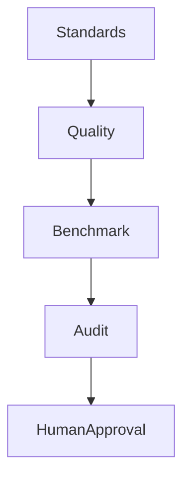

# Unified Governance Compliance Model

| Field | Value |
|-------|-------|
| **Version** | 1.0 |
| **Status** | Canonical |
| **Authority** | Open Grace Architecture Office |
| **Date** | 2026-06-22 |
| **Purpose** | Define the relationship between Standards, Quality, Benchmark, Audit, Architecture, and Research governance agents |

Architecture v1.0 remains frozen. This document clarifies existing responsibilities among canonical agents and registries. It creates **no new capabilities**, **no governance changes**, **no new governance structures**, **no new agents**, and requires **no ADR**.

This model is compliant with [ADR-011 - Architecture Freeze v1.0](../architecture/canonical/08-decision-record.md#adr-011-architecture-freeze-v10), the [Architecture Registry](architecture-registry.md), the [Capability Registry](capability-registry.md), and the existing agent specifications:

- [Quality Review Agent (13)](../architecture/canonical/13-quality-review-agent.md)
- [Standards Agent (22)](../architecture/canonical/22-standards-agent.md)
- [Benchmark Agent (23)](../architecture/canonical/23-benchmark-agent.md)
- Architecture Agent (24), as listed in the [Capability Registry](capability-registry.md)
- [Research Agent (25)](../architecture/canonical/25-research-agent.md)
- [Audit Agent (26)](../architecture/canonical/26-audit-agent.md)

---

## 1. Purpose

The Unified Governance Compliance Model defines how correctness, content quality, performance measurement, evidence verification, architecture compliance, and research readiness relate across the existing governance agents.

The model is descriptive and boundary-setting. It does not grant approval authority to any agent, does not alter the AI Fabric governance chain, and does not modify any registry.

---

## 2. Responsibilities

| Agent | Responsibility |
|-------|----------------|
| **Standards Agent (22)** | Defines correctness through Standards Registry authority, compliance profiles, and waiver definitions |
| **Quality Review Agent (13)** | Validates content before publication, including metadata, rights, accessibility, and completeness |
| **Benchmark Agent (23)** | Evaluates agent and system performance through thresholds, regression detection, and benchmark suites |
| **Audit Agent (26)** | Verifies evidence after execution, provenance integrity, steward approvals, and the existence of standards and benchmark reports |
| **Architecture Agent (24)** | Performs architecture compliance review, ADR review, registry alignment review, and architecture freeze enforcement |
| **Research Agent (25)** | Performs literature review, dataset review, source evaluation, and research fabric readiness assessment |

---

## 3. Canonical Responsibility Matrix

In this matrix, **Writes** means canonical writes or governance-state writes. Report artifacts, findings, scorecards, and review records do not by themselves approve publication, deployment, registry changes, or canonical state changes.

| Agent | Defines | Measures | Validates | Audits | Approves | Writes |
|-------|---------|----------|-----------|--------|----------|--------|
| **Standards Agent (22)** | Correctness rules, compliance profiles, waiver definitions, and Standards Registry interpretation | Standards conformance coverage and pass/fail signals | Standard-specific conformance against registered profiles | No; does not audit execution | No; Architecture Office and stewards decide waivers and disposition | No canonical writes; emits Standards Compliance Reports |
| **Quality Review Agent (13)** | No; uses standards and quality profiles | Quality scores for metadata, rights, accessibility, and completeness | Content before publication or research-channel release | No | No; stewards and curators decide disposition | No autonomous canonical writes; approved quality annotations require steward gate |
| **Benchmark Agent (23)** | Benchmark suite registration expectations and threshold references from agent specs and registries | Agent and system performance, quality metrics, architecture compliance signals, thresholds, and regressions | Benchmark result integrity against registered suites | No; provides benchmark evidence for audit | No; does not approve publication, deployment, or production clearance | No canonical writes; emits Benchmark Reports and scorecards |
| **Audit Agent (26)** | No; does not redefine standards, thresholds, or architecture rules | Audit coverage and finding confidence | Evidence existence, provenance integrity, steward approval chains, and report presence after execution | Evidence, provenance, standards-report existence, benchmark-report existence, registry consistency, and approval-chain integrity | No; humans accept audit findings and remediation closure | No canonical writes; emits Audit Reports and Remediation Reports |
| **Architecture Agent (24)** | No new architecture; reviews against Architecture v1.0, ADRs, and registries | Architecture drift indicators and registry alignment gaps | Architecture compliance, ADR applicability, registry alignment, and freeze compliance | No; audit remains Audit Agent scope | No; Architecture Office approves ADRs, waivers, and architecture-affecting disposition | No autonomous canonical writes; registry or ADR changes require existing human process |
| **Research Agent (25)** | Research methodology and dataset review protocols within existing Research Fabric scope | Evidence sufficiency, literature coverage, dataset readiness, and source quality signals | Literature, datasets, sources, and research fabric readiness | No | No; Research Council, stewards, or Architecture Office decide disposition | No canonical writes; emits Research Findings Reports and dataset manifests |

---

## 4. Governance Sequence

The canonical governance sequence for compliance evidence is:

```text
Standards -> Quality -> Benchmark -> Audit -> Human Approval
```

| Step | Function |
|------|----------|
| **Standards** | Defines correctness profiles and applicable standards before validation and measurement |
| **Quality** | Validates content readiness against metadata, rights, accessibility, and completeness expectations before publication |
| **Benchmark** | Measures agent and system performance against registered thresholds and detects regressions |
| **Audit** | Verifies after execution that evidence, provenance, steward approvals, Standards Reports, and Benchmark Reports exist |
| **Human Approval** | Stewards, councils, partner authorities, and the Architecture Office decide disposition under existing authority |

---

## 5. Mermaid Diagram



---

## 6. Explicit Boundary Rules

1. **Audit Agent MUST NOT redefine standards. Audit Agent verifies standards were correctly applied.**
2. **Benchmark Agent measures performance. Benchmark Agent does not approve publication.**
3. **Quality Review Agent validates content. Quality Review Agent does not define standards.**
4. **Standards Agent defines correctness. Standards Agent does not audit execution.**
5. **Architecture Agent enforces Architecture v1.0 compliance through review. Architecture Agent does not create new governance structures without ADR.**
6. **Research Agent reviews literature, datasets, sources, and research readiness. Research Agent does not convert findings into canonical assertions.**
7. **Human approval remains final for publication, deployment, waivers, ADRs, steward-sensitive decisions, and canonical writes.**

---

## 7. Validation

| Requirement | Status |
|-------------|--------|
| Architecture v1.0 compliant | Compliant - clarifies frozen Architecture v1.0 responsibilities only |
| ADR-011 compliant | Compliant - no expansion beyond frozen architecture |
| No governance changes | Compliant - responsibility boundaries are clarified, not changed |
| No new governance structures | Compliant - existing agents, registries, and human authorities only |
| No new capabilities | Compliant - uses existing canonical and Draft registry entries only |
| No new agents | Compliant - references agents 13 and 22-26 only |
| No ADR required | Compliant - no architecture change is introduced |
| Single canonical document only | Compliant - this document is the sole output artifact |

---

## 8. Non-Expansion Clause

This document must not be used to justify new agent capabilities, new approval paths, new governance bodies, new registries, or new canonical write permissions. Any future change that alters responsibilities, authorities, lifecycle gates, or registry state remains subject to the existing Architecture Registry change-control process and ADR-011.
