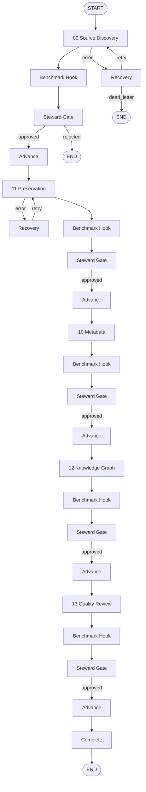

# RC1 LangGraph Orchestration — Implementation Plan

| Field | Value |
|-------|-------|
| **Version** | 1.0 |
| **Status** | Implementation scaffold |
| **Authority** | architecture-v1.0 (frozen) |
| **Target** | Reference Capability 1 — Stonehenge |
| **Package** | `packages/wise-orchestration` |

---

## 1. Purpose

This document defines the production-quality LangGraph orchestration plan for Reference Capability 1 (RC1). It wires the five canonical Platform agents (09–13) into a single stateful pipeline with steward approval gates, Benchmark Agent evaluation hooks, provenance propagation, and error recovery — without introducing new agent categories or architecture changes.

---

## 2. Scope

### In scope

- LangGraph `StateGraph` for Stonehenge RC1
- Typed state schema (`RC1GraphState`)
- One node per agent: 09 Source Discovery, 11 Preservation, 10 Metadata, 12 Knowledge Graph, 13 Quality Review
- Pipeline order: **Discovery → Preservation → Metadata → Knowledge Graph → Quality Review**
- Steward approval interrupt after each agent (proposed → approved/rejected)
- Benchmark Agent **evaluation hook** per [23-benchmark-agent.md](../architecture/canonical/23-benchmark-agent.md) (not a graph node category)
- Evidence Output Profile and provenance event ID chaining
- Error recovery: retry, dead-letter, steward escalation
- Integration with `wise-contracts` and `wise-reference` Stonehenge seed

### Out of scope

- New observatories, constitutional structures, or agent categories
- Live LLM calls in agent nodes (stubs use RC1 seed + contract validation)
- Production persistence of graph checkpoints (MemorySaver in scaffold)
- Ingestion service (Phase 2) as separate graph — preservation node consumes approved discovery

---

## 3. Architecture alignment

| Canonical doc | Implementation |
|---------------|----------------|
| [09-source-discovery-agent.md](../architecture/canonical/09-source-discovery-agent.md) | `nodes/source_discovery.py` |
| [11-preservation-agent.md](../architecture/canonical/11-preservation-agent.md) | `nodes/preservation.py` |
| [10-metadata-agent.md](../architecture/canonical/10-metadata-agent.md) | `nodes/metadata.py` |
| [12-knowledge-graph-agent.md](../architecture/canonical/12-knowledge-graph-agent.md) | `nodes/knowledge_graph.py` |
| [13-quality-review-agent.md](../architecture/canonical/13-quality-review-agent.md) | `nodes/quality_review.py` |
| [23-benchmark-agent.md](../architecture/canonical/23-benchmark-agent.md) §4 | `hooks/benchmark.py` |
| [architecture-overview.md](../../architecture-overview.md) §4 | `gates/approval.py` |
| [03-canonical-architecture.md](../architecture/canonical/03-canonical-architecture.md) §6.6 | `provenance.py` |

---

## 4. Graph state schema

`RC1GraphState` (TypedDict) holds:

| Field | Purpose |
|-------|---------|
| `stable_id`, `target_title` | RC1 object identity (default: `stonehenge`) |
| `current_stage`, `next_stage` | Pipeline position |
| `discovery_record`, `preserved_object`, `metadata_record`, `entity_assertion`, `graph_entity`, `quality_review` | Agent artifacts (dict payloads validated against `wise-contracts`) |
| `premis_events` | PREMIS chain from preservation |
| `approval_gate` | Steward gate context (gate_id, stage, status, steward_id) |
| `pending_interrupt` | True when graph paused for human review |
| `provenance_chain` | Ordered provenance event IDs (reducer: append-unique) |
| `errors`, `retry_count`, `max_retries`, `dead_letter`, `steward_escalation` | Recovery state |
| `benchmark_reports` | Benchmark hook results (reducer: append) |
| `agent_versions` | Registered agent version map |

Pydantic models (`ApprovalGateState`, `ErrorRecord`, `BenchmarkReportRef`) support serialization and validation at boundaries.

---

## 5. Pipeline transitions



Each agent node:

1. Loads Stonehenge seed slice via `wise_reference.seed.stonehenge.build_stonehenge_seed()`
2. Sets artifact `status` to `proposed`
3. Validates against `wise-contracts` Pydantic models
4. Appends provenance event IDs to `provenance_chain`
5. Sets `approval_gate` and `pending_interrupt=True`

---

## 6. Steward approval gate

Implementation: `gates/approval.py` using LangGraph `interrupt()`.

**Flow:**

1. Agent completes → benchmark hook runs → `steward_approval_gate` node executes
2. If `approval_gate.status == proposed`, graph calls `interrupt()` with gate metadata and artifact snapshot
3. External process (UI, CLI, API) resumes with `Command(resume={"decision": "approved"|"rejected", "steward_id": "...", ...})`
4. On **approved**: artifact status → `approved`; graph advances via `advance_stage`
5. On **rejected**: pipeline → `FAILED`; graph ends

**States:** `proposed` → `approved` | `rejected` (matches PostgreSQL `status` columns in architecture-overview §4).

---

## 7. Benchmark Agent evaluation hook

Per [23-benchmark-agent.md](../architecture/canonical/23-benchmark-agent.md): the Benchmark Agent is **not** a pipeline node category. Instead, `hooks/benchmark.py` runs after each agent:

- Scores artifacts against registered thresholds (from agent spec §AI Fabric Governance)
- Emits `BenchmarkReportRef` appended to `benchmark_reports`
- Results: `pass`, `warn`, `fail` — informational; does not block pipeline in RC1 scaffold (production may gate on `fail`)

---

## 8. Provenance propagation

`provenance.py` helpers:

- `build_evidence_profile()` — Evidence Output Profile (§6.6)
- `build_provenance_ref()` — PREMIS-aligned event refs
- `append_provenance_event()` — chain reducer
- `propagate_from_seed()` — seed chain bootstrap

Chain for Stonehenge:

```
discovery-stonehenge-* → ingest-stonehenge-* → fixity-* → modeling-stonehenge-* → graph-stonehenge-* → quality-stonehenge-*
```

Each assertion-making output carries `evidence.provenance_event_id` linking to the chain.

---

## 9. Error recovery

`recovery.py` policies:

| Condition | Route |
|-----------|-------|
| Retryable error, `retry_count < max_retries` | Re-run same agent node |
| Max retries exceeded | `dead_letter=True`, stage `dead_letter`, END |
| Non-retryable error | `steward_escalation=True`, END |
| Steward rejection | `FAILED`, END |

Agent nodes wrapped with `_wrap_agent()` to catch exceptions and emit structured `ErrorRecord`.

---

## 10. Repository structure

```
packages/wise-orchestration/
├── pyproject.toml
├── README.md
└── src/wise_orchestration/
    ├── __init__.py
    ├── state.py              # RC1GraphState
    ├── graph.py              # StateGraph assembly
    ├── provenance.py
    ├── recovery.py
    ├── run.py                # CLI
    ├── nodes/
    │   ├── source_discovery.py   # 09
    │   ├── preservation.py       # 11
    │   ├── metadata.py           # 10
    │   ├── knowledge_graph.py    # 12
    │   └── quality_review.py     # 13
    ├── gates/
    │   └── approval.py
    └── hooks/
        └── benchmark.py

docs/implementation/
└── rc1-langgraph-orchestration.md   # this document

tests/orchestration/
├── test_graph_compile.py
├── test_state_transitions.py
└── test_approval_interrupt.py
```

---

## 11. Integration points

| Package | Usage |
|---------|-------|
| `wise-contracts` | Validate all agent outputs (`DiscoveryRecord`, `PreservedObjectDescriptor`, `EntityAssertion`, `GraphEntity`, `QualityReviewRecord`, `EvidenceOutputProfile`) |
| `wise-reference` | `build_stonehenge_seed()` as deterministic RC1 fixture |
| `wise-registry` | Future: live Source Registry lookups in discovery node |
| `wise-metadata` | Future: replace metadata node stub with `wise_metadata.services.pipeline` |

---

## 12. Dependencies

```toml
langgraph>=0.2.0
langchain-core>=0.3.0
pydantic>=2.0
wise-contracts
wise-reference
```

---

## 13. Running the orchestrator

```bash
pip install -e packages/wise-contracts -e packages/wise-reference -e packages/wise-orchestration
python -m wise_orchestration.run --stable-id stonehenge --auto-approve
pytest tests/orchestration -q
```

Programmatic:

```python
from langgraph.checkpoint.memory import MemorySaver
from wise_orchestration import build_rc1_graph, initial_state_for_stonehenge
from wise_orchestration.gates.approval import resume_with_approval

graph = build_rc1_graph(checkpointer=MemorySaver())
config = {"configurable": {"thread_id": "stonehenge-001"}}
state = graph.invoke(initial_state_for_stonehenge(), config)
# ... handle interrupt ...
state = resume_with_approval(graph, config, decision="approved")
```

---

## 14. Production evolution (not in scaffold)

1. Replace MemorySaver with PostgreSQL checkpointer
2. Wire discovery node to `discovery-service` UNESCO connector
3. Wire preservation node to `preservation-service` BagIt ingest
4. Expose steward gate via `api-service` REST + Demonstration Surface queue
5. Connect benchmark hook to OpenTelemetry + Benchmark Agent fleet runner
6. Parameterize graph for additional RC1 objects beyond Stonehenge

---

*Authority: architecture-v1.0 frozen · Agents 09–13 + Benchmark hook per 23*
